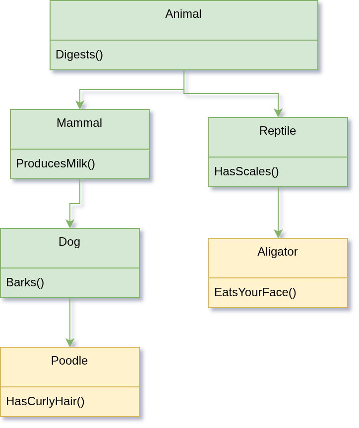

# Who Am I?

- Software Engineer in New York City.

. . .

- There is nothing else interesting about me. 

# Java.

. . .

- If you are at this conference, you probably have an opinion of Java

. . . 

- Likely very negative. 

. . . 


# Why the Java Hate? 

. . . 

- Java is bloated and verbose. 
  
. . . 

- Encourages bad practices.

. . . 

- Java progammers...

# Examples of (Historically) Bad Things In Java. 

. . . 

- IO is blocking by default

. . . 

- `synchronized` is evil. 

. . . 
 
# Examples of (Historically) Bad Things In Java. 

. . . 




# So Why Would We Want To Even Use Java?

. . . 

- A metric ton of well-tested and supported libraries and guides online. 

. . . 

- Relatively portable, even still. 

. . . 

- Lots of great tooling around the language in the form of IDEs and benchmarking tools available. 

. . . 

- (Can be) fast.


# Storytime. 

. . .


. . .


# Why Not Kotlin? Or Clojure?

. . . 

- You *should* use Clojure if you can!

. . . 

- Java is inescapable.
 
. . . 

- A lot of companies still have tens of thousands of lines of Java that already exist. 

. . . 

- Many companies will find it infeasible to migrate to a better language, and would rather spend infinitely more money hiring dozens of engineers to write a million incrementatal patches to a Java codebase.  

. . . 
 
- Many of us are stuck in this hell. 

# Modern Java

. . . 

- In 2024 I took a job doing Java full-time. 

. . . 

- They were unreceptive to my plees to use Clojure, no matter how much I complained.   

. . . 

- Eventually, I realized that I wasn't going to win this fight and instead I should at least figure out what Java 21 had to offer. 

. . . 
  
- Much to my astonishment, *I actually enjoyed it!*

. . . 

# What Changed? 

. . . 

- Since Java 8 and Java 11, there has been a much higher emphasis on functional programming concepts and updated syntax to facilitate it. 

. . . 

- Java programmers have *finally* joined the 21st century and will *occasionally* use non-blocking IO. 

. . . 

- Concurrency is an even bigger part of the language, and a lot of the features from concurrent-first languages have been brought over. 

. . . 


# Java 21 New Features.  

. . . 

## Virtual Threads. 

. . . 

- Virtual Threads are what should have been in Java twenty years ago. 

. . . 

- Roughly analogous to goroutines in Go.  

. . . 

- Allow you to have blocking code inside the thread without it breaking the pool.  
	- The JVM will park the thread upon seeing a blocking call. 
. . . 
 
- Extremely lightweight, hundreds of thousands can easily be spun up guilt-free. 

. . . 

- Implements the same interfaces as regular threads and thus are drop-in replacement. 

. . . 

- TODO Example. 

# Java 21 New Features*  

. . . 

\* (Actually a Java 15 feature that I wasn't aware of until Java 21)

## ZGC

. . . 

- Low-latency garbage collector.

. . . 

- Pause times are generally sub-millisecond and almost never exceed ten milliseconds. 

. . . 

- Configurable, can be enabled or disabled per-project. 
 

# Java 21 New Features.  

. . . 

## Records

. . . 

- Much simpler than a class.

. . . 

- Doesn't require its own dedicated file. 

. . . 

- Can be pattern-matched.

. . .  

- TODO Example. 
 
# Java 21 New Features*  

. . . 

\* (Actually a Java 17 feature that I wasn't aware of until Java 21)

# Sealed Interfaces

. . . 

- Basically Algebraic Data Types

. . .

- Can be recursive.

. . . 

- Can be pattern matched. 

. . . 


# Java 21 New Features.  

. . . 


## Pattern Matching

. . . 

- FINALLY!  FINALLY!

. . . 

- Can be done inside `if` statements and `switch` cases. 

. . .  

- TODO Example. 

# Java NIO

. . .  

- Java New IO.

. . .  

- Gives fine-grained control over IO, both blocking and non-blocking.  

. . .  

- Not new at all, but underutilized. 

. . .  

- TODO Basic Node.js pipes example. 

# Vert.x

. . .  

- (In a hand-wavey way) a port of Node.js to Java. 

. . . 

- High performance. 

. . . 

- Provides constructs to handle local and distributed concurrency transparently. 


# Vert.x Core Primitives


. . . 

## **Verticle**

. . . 

  - Units of deployment and concurrency

. . . 

  - Two types: StandardVerticle (blocking) and WorkerVerticle (non-blocking optional)

. . . 
   
  - Deployed with `vertx.deployVerticle(...)`
 
# Vert.x Core Primitives

## **Event Loop**

. . . 
   
  - Single or multi-threaded, async task execution

. . . 
   
  - Based on Netty

. . . 
 
  - Designed for minimal context switching and high throughput

# Vert.x Core Primitives

. . . 

## **Event Bus**

. . . 
 
  - Lightweight messaging system

. . . 
 
  - Supports publish/subscribe, point-to-point, and request-response

. . . 
 
  - Accepts JSON, POJOs (with codec), and buffers

. . . 
 
# Vert.x Core Primitives

. . . 

## **Future & Promise**

. . . 
 
  - Asynchronous result handling

. . . 
 
  - `Future<T>` is the result placeholder

. . . 
 
  - `Promise<T>` is the result provider

. . . 
 
  - Supports chaining with `.compose(...)` and `.map(...)`


. . . 
 
# Vert.x Core Primitives

. . . 
 
## **Context**

. . . 
 
  - Execution environment for a Verticle

. . . 
 
  - Ensures thread-affinity

. . . 
 
  - Helps avoid shared-state concurrency bugs


. . . 
 
# Vert.x Core Primitives

. . . 
 
## **Buffer**

. . . 
 
  - Efficient binary data container

. . . 
 
  - Higher-level alternative to Netty's ByteBuf

. . . 
 
  - Used in I/O and message passing


. . . 
 
# Vert.x Core Primitives

. . . 
 
## **WebClient / HttpClient**

. . . 
 
  - Non-blocking HTTP clients

. . . 
 
  - Built-in connection pooling and retry logic

. . . 
 
  - Supports JSON, form data, and streaming


. . . 
 
# Vert.x Core Primitives

. . . 
 
## **Timer / Periodic Tasks**

. . . 
 
  - Use `setTimer(...)` for delayed execution

. . . 
 
  - Use `setPeriodic(...)` for recurring tasks

. . . 
 
  - Executes on the event loop thread


. . . 
 
```java 
void doSomethingAsync(Promise<String> promise) {
  vertx.setTimer(500, id -> {
    promise.complete("Hello, future!");
  });
}

```
 
 
# Vert.x Core Primitives

. . . 
 
 
## **SharedData**

. . . 
 
  - Minimal shared-state coordination mechanism

. . . 
 
  - Offers maps, locks, and counters

. . . 
 
  - Supports clustered and local modes

. . . 


# Backpressure in Vert.x

. . . 

- Vert.x models backpressure using `ReadStream` and `WriteStream`

. . . 

- Data is paused/resumed automatically when the receiver can't keep up

. . . 

- Useful when handling large streams (e.g., file uploads, HTTP bodies)


# Backpressure in Vert.x

. . . 

## Example: Handling a slow `WriteStream`

```java
source.pipeTo(slowSink, res -> {
  if (res.succeeded()) {
    System.out.println("All data written.");
  } else {
    res.cause().printStackTrace();
  }
});

```


 
# Vert.x distributed concurrency example

## Deploying Verticles: Local vs Clustered

- Verticles are the basic unit of deployment and concurrency
- Deployment is nearly identical across local and clustered environments

### Local Deployment

```java
Vertx vertx = Vertx.vertx();
vertx.deployVerticle(new MyVerticle());
```
### Distributed Deployment

```java

Vertx.clusteredVertx(new VertxOptions(), res -> {
  if (res.succeeded()) {
    Vertx vertx = res.result();
    vertx.deployVerticle(new MyVerticle());
  } else {
    res.cause().printStackTrace();
  }
});

```


# RxJava 

. . . 

- TODO Placeholder

. . . 
 
# RxJava Example

. . . 
 
- TODO Placeholder. 

. . . 

# Conclusion. 

. . . 

- Java 21 *isn't that bad*.

. . . 
 
- Convince your employers to upgrade if you want to reclaim your sanity. 

- Blah
. . . 

- Use libraries like Vert.x and Disruptor to make life simpler. 


# Conclusion. 

- thomas@gebert.app
- blog.tombert.com

{width=25%}

- 
